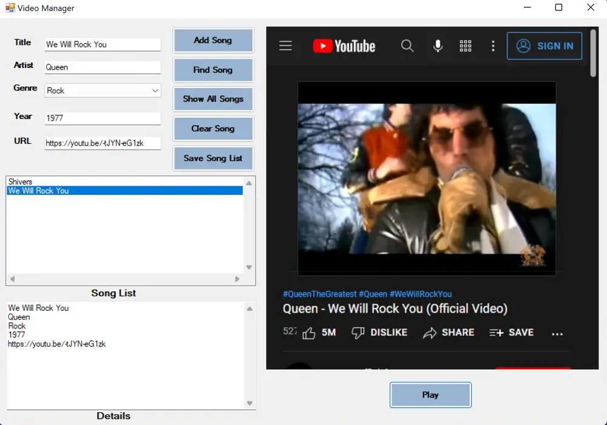

#  🎶 Video Music Manager 🎵

## This program allows the user to store a list of songs from input provided by user.
- Title
- Artist
- Genre
- Year
- URL (Youtube Link of Music Video)

#
## After user saves songs in the program they can press Play and play the selected song's music video in the program.
